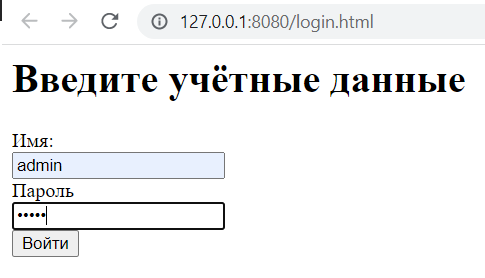
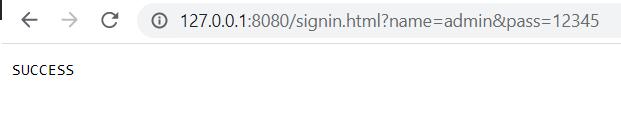
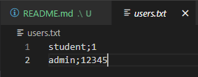

# Отчет по Лабораторной работе №1
> Цель работы: создание первого web приложения.

1. Модифицируйте код в файле server_org.js таким образом, чтобы пользователи и пароли хранились в файле на диске. 

```js
//прочитаем файл с паролями с диска и найдём в нём нашего пользователя
try {
	users = fs.readFileSync('./users.txt', 'utf8');
	console.log(users);
}
```

2. Замените примитивную проверку имени и пароля в строке 18 на проверку при помощи данных из пункта 2.

```js
let account_lines = users.split(/\n/); 
// Строки файла, в каждой строке аккаунт - имя и пароль соединённые через; 

let is_user_exists = false;
let password_to_check = undefined;

for (let account_line of account_lines) {
	let account = account_line.split(';');
	let account_name = account[0];
	let account_pass = account[1];

	if(login === account_name){
		is_user_exists = true;
		password_to_check = account_pass;
		// Нашли пользователя, сохраним его пароль для последующей проверки
        break;
	}
}

//Нашли пользователя, проверим пароль
if(data.pass === password_to_check) {
	rs.writeHead(200);
    // Корректный пароль
	rs.end('SUCCESS');
	return;
}

```

3. Подберите и отдавайте клиенту корректные HTTP коды в случае ошибок.
3.1 Если файл не найден или произошла ошибка при обработке нужно возвращать код из семейства 500.
```js
//прочитаем файл с паролями с диска и найдём в нём нашего пользователя
try {
	users = fs.readFileSync('./users.txt', 'utf8');
	console.log(users);
}
catch (e) {
    // файл не найден или произошла ошибка при обработке
	rs.writeHead(500);
	rs.end('Internal server error');
	console.log('File doesn\'t exist');
	return;
}
```
3.2 Если переданы пустой пользователь или пароль, то следует возвращать код 400.
```js
if (data.name === '' || data.pass === '') {
    // переданы пустой пользователь или пароль
	rs.writeHead(400);
	rs.end('user or password is empty');
	return;
}
```
3.3 Если переданы пользователь не найден или пароль не корректный, то следует возвращать код 403. Если всё хорошо, то код 200:
```js
//  Переданый пользователь не найден
if(is_user_exists === false) {
	rs.writeHead(403);
	rs.end('user does not exists');
	return; //Выходим с ошибкой
}

//Нашли пользователя, проверим пароль
if(data.pass === password_to_check) {
	rs.writeHead(200);
    // Корректный пароль
	rs.end('SUCCESS');
	return;
} else {
    // Ошибка авторизации - Пароль не корректный
	rs.writeHead(403);
	rs.end('wrong password');
	return; //Выходим с ошибкой
}
```
4. Запустите доработанный сервер node .\server_org.js и, пройдя по ссылке, http://127.0.0.1:8080/login.html



Убедитесь, что всё работает корректно: 



Имена и пользователи хранятся во внешнем файле:

