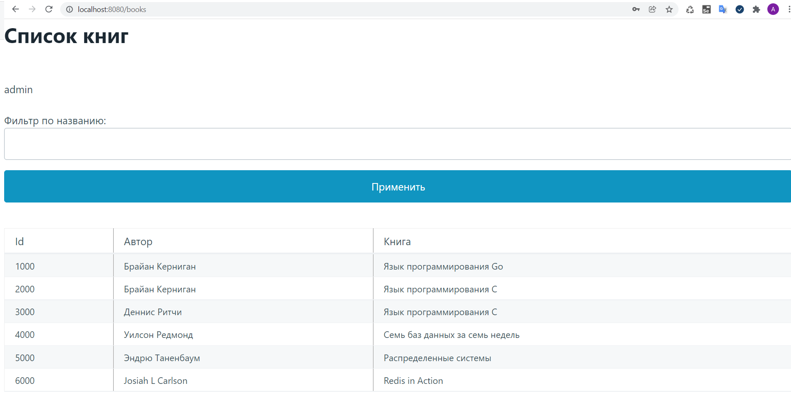
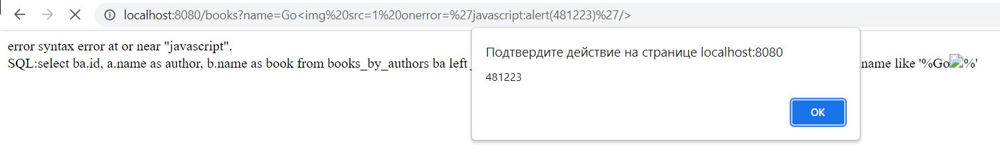
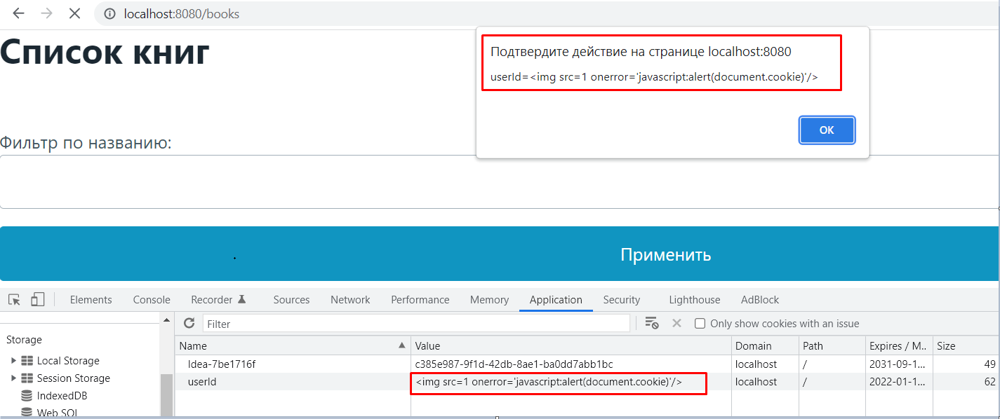
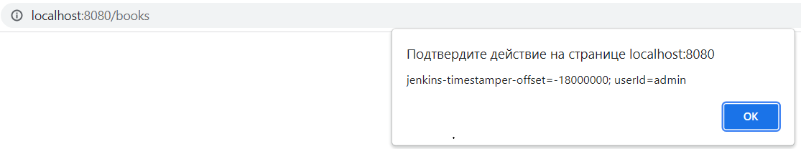

# Отчет по Лабораторной работе №3
> Цель работы: Поиск и устранение XSS уязвимостей.

### 1. Войти на сайт и увидеть список книг и авторов

Чтобы авторизоваться на сайте предварительно создадим пользователя в таблице users, в качестве пароля запишем **md5** хеш:


В результате успешной авторизации и редиректа на route **/books** видим список книг и авторов:



### 2. На странице со списком книг найти
#### 2.1 Reflected XSS в поиске книг



#### 2.2 Persisted (Stored) XSS при создании книги

 XSS")
 XSS")

#### 2.3 Потенциальную уязвимость через Cookie Injection

```span(id='lblUser')``` отображает значение ```cookie``` ```userId```
Изменим его:



#### 2.4 Session hijacking

Похищение cookie любым из 3-х способов приведет к захвату сессии

